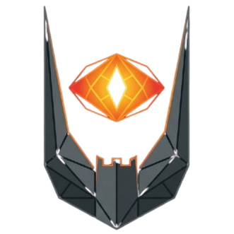

<div align="center">
  
</div>
  
# Awatch (AllWatch)- Next-Generation Intelligent Monitoring System

**Better than AWS CloudWatch.** Open source, AI-powered infrastructure monitoring with sub-second anomaly detection.

> Built for engineers who need real-time insights without vendor lock-in.

---

## Vision: A Superior CloudWatch Alternative

Awatch is designed from the ground up to solve CloudWatch's limitations:

| Feature               | AWS CloudWatch               | Awatch                           |
| --------------------- | ---------------------------- | -------------------------------- |
| **Granularity**       | 1 minute (5 min default)     | **1 second** (default)           |
| **Anomaly Detection** | Basic ML (Random Cut Forest) | **Deep Learning (Autoencoders)** |
| **Latency**           | 5+ minute alert delay        | **Sub-second detection**         |
| **Deployment**        | AWS-only SaaS                | **Edge/offline + cloud**         |
| **Vendor Lock-in**    | ✗ Total lock-in              | ✓ Self-hosted or managed         |
| **Cost at Scale**     | $$$ per metric               | Fixed infrastructure cost        |
| **Data Retention**    | 15 months max                | **Unlimited** (tiered storage)   |
| **Customization**     | Limited                      | **Full source access**           |

---

## Key Differentiators

### 1. **1-Second Granularity**

Real-time metrics collection vs CloudWatch's 1-minute standard (or expensive high-resolution mode).

### 2. **AI-Powered Anomaly Detection**

- **Autoencoders** detect complex multi-dimensional patterns
- Learns "normal" behavior automatically (no manual thresholds)
- Detects anomalies CloudWatch misses (e.g., low CPU + high disk = potential memory leak)

### 3. **Edge/Offline Deployment**

- Works on **air-gapped networks** (critical for security-sensitive environments)
- Local-first architecture with optional cloud sync
- CloudWatch requires internet connectivity

---

## Architecture

### Distributed Node Design

```
┌─────────────────────────────────────────────────────────────────────────┐
│                              NODO A (Agent)                             │
│  ┌─────────────┐     ┌─────────────┐     ┌─────────────┐               │
│  │  Collector  │────▶│   gRPC      │────▶│    NATS     │               │
│  │   (Go)      │     │   Client    │     │   Client    │               │
│  └─────────────┘     └─────────────┘     └──────┬──────┘               │
│  • CPU, RAM, Network monitoring                  │                      │
│  • 1-second collection interval                  │                      │
└─────────────────────────────────────────────────┼───────────────────────┘
                                                  │
                                                  ▼
┌─────────────────────────────────────────────────────────────────────────┐
│                              NODO B (Broker)                            │
│  ┌──────────────────────────────────────────────────────────────────┐   │
│  │                          NATS JetStream                           │   │
│  │  Message Queue + Persistence                                     │   │
│  └──────────────────────────────────────────────────────────────────┘   │
│                                                                          │
│  ┌─────────────────────────────────────────────────────────────────┐    │
│  │              InfluxDB (Time Series Database)                     │    │
│  │  • Hot storage: Recent 7 days (fast queries)                     │    │
│  │  • Warm storage: 90 days (compressed)                            │    │
│  │  • Cold storage: Unlimited (archive)                             │    │
│  └─────────────────────────────────────────────────────────────────┘    │
│                                                                          │
│  ┌─────────────────────────────────────────────────────────────────┐    │
│  │            PostgreSQL (Metadata)                                 │    │
│  │  • User accounts, alert configs, incidents                       │    │
│  └─────────────────────────────────────────────────────────────────┘    │
└─────────────────────────────────────────────────────────────────────────┘
                                                  │
                                                  ▼
┌─────────────────────────────────────────────────────────────────────────┐
│                           NODO C (AI Worker)                            │
│  ┌─────────────────────────────────────────────────────────────────┐   │
│  │              PyTorch Autoencoder (Anomaly Detection)             │   │
│  │                                                                   │   │
│  │  1. Train on "normal" server behavior                            │   │
│  │  2. Calculate reconstruction error for new data                  │   │
│  │  3. High error = Anomaly detected!                               │   │
│  │  4. Real-time alerting via WebSocket                             │   │
│  └─────────────────────────────────────────────────────────────────┘   │
│                                                                          │
│  ┌─────────────┐     ┌─────────────┐                                    │
│  │   FastAPI   │────▶│  WebSocket  │────────────────▶ Dashboard         │
│  │   REST API  │     │   Server    │                                    │
│  └─────────────┘     └─────────────┘                                    │
└─────────────────────────────────────────────────────────────────────────┘
```

### Tech Stack

| Component          | Technology                  | Why?                                              |
| ------------------ | --------------------------- | ------------------------------------------------- |
| **Agent**          | Go + gRPC                   | Lightweight binary, streaming support             |
| **Transport**      | NATS JetStream              | Modern message queue, better than RabbitMQ for Go |
| **AI Engine**      | Python + PyTorch            | Best ML ecosystem for autoencoders                |
| **API**            | FastAPI                     | High-performance async Python framework           |
| **Dashboard**      | React + TypeScript          | Modern, type-safe frontend                        |
| **Time Series DB** | InfluxDB                    | Purpose-built for metrics, automatic retention    |
| **Metadata DB**    | PostgreSQL                  | Reliable, proven for structured data              |
| **Orchestration**  | Docker Compose / Kubernetes | Dev + production deployment                       |

---

## AI Strategy

### Phase 1: Universal Model (Current)

- **Single global autoencoder** trained on all server metrics
- Detects general anomalies across infrastructure
- Simple to deploy and maintain

### Phase 2: Hybrid Intelligence (Future)

- **Per-server model refinement** for workload-specific detection
- Server type classification (web, database, ML worker)
- Transfer learning from global to specialized models

**Why Autoencoders?**

- **Unsupervised learning**: No manual labeling required
- **Multi-dimensional**: Detects patterns across CPU, RAM, network simultaneously
- **Dynamic thresholds**: Adapts to changing workload patterns
- **Superior to CloudWatch's Random Cut Forest**: Better at complex temporal patterns

---

## Product Strategy

### Current: Internal Monitoring

- Self-hosted for your own infrastructure
- 3-node distributed architecture
- Simple deployment, no multi-tenancy complexity

### Future: SaaS Offering

**Model**: Self-hosted + Managed (source available)

**Why this model?**

- ✅ **Self-hosted option**: Full control, no vendor lock-in (unlike CloudWatch)
- ✅ **Managed service**: Pay for convenience (hosted by Awatch team)
- ✅ **Source available**: Audit code, build trust, enable contributions
- ✅ **Flexible migration**: Start self-hosted, move to managed later

**Target customers**:

- DevOps teams frustrated with CloudWatch costs
- Security-conscious orgs needing air-gapped monitoring
- Multi-cloud deployments (AWS + GCP + Azure + on-prem)

---

## Project Structure

```
awatch/
├── services/
│   ├── agent/              # Go agent (Nodo A)
│   │   ├── cmd/            # Main entry point
│   │   ├── pkg/
│   │   │   ├── collector/  # Metrics collection (CPU, RAM, network)
│   │   │   ├── grpc/       # gRPC client
│   │   │   ├── config/     # Configuration management
│   │   │   └── models/     # Data models
│   │   └── Dockerfile
│   │
│   ├── ai-worker/          # Python AI worker (Nodo C)
│   │   ├── app/            # FastAPI application
│   │   ├── src/
│   │   │   ├── autoencoder/  # PyTorch model & trainer
│   │   │   ├── api/          # NATS client
│   │   │   └── config/       # Settings
│   │   └── Dockerfile
│   │
│   └── broker/             # NATS configuration (Nodo B)
│
├── frontend/               # React dashboard
│   ├── src/
│   │   ├── components/     # Reusable UI components
│   │   ├── pages/          # Dashboard pages
│   │   ├── services/       # API clients
│   │   └── store/          # State management
│   └── Dockerfile
│
├── proto/                  # gRPC protobuf definitions
│   └── metrics.proto
│
├── deployments/
│   ├── docker/             # Docker Compose configs
│   ├── k8s/                # Kubernetes manifests
│   └── terraform/          # Infrastructure as Code
│
├── docs/
│   ├── ARCHITECTURE.md     # Detailed architecture
│   └── API.md              # API documentation
│
└── docker-compose.yml      # Full stack orchestration
```

---

## Core Features (v1.0)

### Must-Have

- [x] **Metrics Dashboard**: Grafana integration + custom React views
- [x] **Real-time Alerts**: WebSocket-based instant notifications
- [x] **Anomaly Detection**: Autoencoder-powered AI detection
- [x] **Custom Metrics API**: gRPC + HTTP endpoints for custom data
- [x] **REST API Access**: Full programmatic control

### Should-Have (v2.0)

- [ ] **Log Aggregation**: Centralized log collection and search
- [ ] **Distributed Tracing**: Request flow visualization across services
- [ ] **Predictive Scaling**: Pre-warm resources before load spikes
- [ ] **Cost Optimization**: Detect underutilized resources

### Could-Have (Future)

- [ ] **Natural Language Queries**: "Show me slow servers in the last hour"
- [ ] **Auto-remediation**: Automatic service restart on anomalies
- [ ] **Multi-cluster Correlation**: Detect datacenter-wide issues
- [ ] **Mobile App**: iOS/Android monitoring on-the-go

---

## Data Retention Strategy

**Better than CloudWatch's 15-month limit:**

| Tier        | Storage            | Retention | Query Speed | Cost    |
| ----------- | ------------------ | --------- | ----------- | ------- |
| **Hot**     | InfluxDB Memory    | 7 days    | Sub-second  | High    |
| **Warm**    | InfluxDB SSD       | 90 days   | Fast        | Medium  |
| **Cold**    | S3/MinIO (Parquet) | Unlimited | Slow        | Low     |
| **Archive** | Glacier            | Forever   | Batch only  | Minimal |

**Automatic lifecycle management:**

- Metrics auto-downsampled (1s → 1m → 1h)
- Configurable per-metric retention policies
- Zero manual intervention required

---

## Quick Start

### Prerequisites

- Docker 20.10+
- Docker Compose 2.0+
- 4GB RAM minimum

### Development Setup

```bash
# Clone repository
git clone https://github.com/yourusername/awatch.git
cd awatch

# Start all services
docker-compose up -d

# Verify services
docker-compose ps

# Access dashboard
open http://localhost:3000

# Access Grafana
open http://localhost:3001 (admin/admin)
```

### Service Endpoints

| Service       | URL                   | Purpose               |
| ------------- | --------------------- | --------------------- |
| Dashboard     | http://localhost:3000 | Main UI               |
| Grafana       | http://localhost:3001 | Metrics visualization |
| AI Worker API | http://localhost:8000 | REST API              |
| InfluxDB      | http://localhost:8086 | Time series database  |
| NATS          | nats://localhost:4222 | Message broker        |

---

## Development

### Agent (Go)

```bash
cd services/agent

# Install dependencies
go mod download

# Run locally
go run cmd/main.go

# Build binary
go build -o agent cmd/main.go

# Run tests
go test ./...
```

### AI Worker (Python)

```bash
cd services/ai-worker

# Create virtual environment
python -m venv venv
source venv/bin/activate  # Windows: venv\Scripts\activate

# Install dependencies
pip install -r requirements.txt

# Run locally
uvicorn app.main:app --reload

# Train autoencoder
python -m src.autoencoder.trainer
```

### Frontend (React)

```bash
cd frontend

# Install dependencies
npm install

# Run dev server
npm run dev

# Build for production
npm run build
```

---

## Roadmap

### Phase 1: MVP (Q1 2026) ✅ Current

- [x] Basic agent metrics collection
- [x] InfluxDB + PostgreSQL storage
- [x] Autoencoder anomaly detection
- [x] Simple dashboard
- [x] Docker Compose deployment

### Phase 2: Production Ready (Q2 2026)

- [ ] Complete gRPC protobuf implementation
- [ ] WebSocket real-time alerting
- [ ] Grafana dashboard templates
- [ ] Agent installer scripts (Linux, macOS, Windows)
- [ ] Kubernetes deployment manifests
- [ ] Multi-server monitoring
- [ ] Alert management UI

### Phase 3: Advanced AI (Q3 2026)

- [ ] Per-server model refinement
- [ ] Server type classification
- [ ] Predictive anomaly detection (forecast failures)
- [ ] Correlation analysis (detect cascading failures)
- [ ] Model versioning and A/B testing

### Phase 4: SaaS Launch (Q4 2026)

- [ ] Multi-tenancy architecture
- [ ] User authentication (OAuth2/JWT)
- [ ] API key management
- [ ] Per-tenant data isolation
- [ ] Billing integration
- [ ] Managed hosting option

### Phase 5: Enterprise Features (2027)

- [ ] Log aggregation + search
- [ ] Distributed tracing (OpenTelemetry)
- [ ] RBAC (role-based access control)
- [ ] SSO integration (SAML, OIDC)
- [ ] Audit logs
- [ ] Compliance reports (SOC 2, GDPR)

---

## Why Awatch Wins

### vs AWS CloudWatch

- ✅ **10x faster detection** (1s vs 1min granularity)
- ✅ **Smarter AI** (autoencoders vs basic ML)
- ✅ **No vendor lock-in** (self-hosted option)
- ✅ **Unlimited retention** (vs 15 months)
- ✅ **Works offline** (edge deployment)

### vs Prometheus + Grafana

- ✅ **Built-in AI** (no manual alert rules)
- ✅ **Easier setup** (integrated stack)
- ✅ **Better for ops teams** (less config required)

### vs Datadog

- ✅ **Open source** (full transparency)
- ✅ **Self-hosted** (data privacy control)
- ✅ **Fixed cost** (no per-host pricing)

---

## Standards & Compliance

- **OpenTelemetry**: Industry-standard metrics collection
- **ISO/IEC 25010**: Software quality metrics
- **OAuth2 / JWT**: Secure authentication between nodes
- **gRPC + Protobuf**: Efficient binary communication
- **NATS JetStream**: Reliable message delivery

---

## Documentation

- [Architecture Deep Dive](docs/ARCHITECTURE.md)
- [API Reference](docs/API.md)
- [Deployment Guide](docs/DEPLOYMENT.md) _(coming soon)_
- [Contributing Guide](docs/CONTRIBUTING.md) _(coming soon)_

---

## Contributing

Awatch is source-available under **PolyForm Strict 1.0.0**.

**Contributions welcome!** We're building this in the open.

- Report bugs via [GitHub Issues](https://github.com/yourusername/awatch/issues)
- Suggest features via [Discussions](https://github.com/yourusername/awatch/discussions)
- Submit PRs for bug fixes and improvements

---

## License

Licensed under **PolyForm Strict 1.0.0** (source-available, not open source).

**You can:**

- ✅ Use for personal/internal monitoring
- ✅ Study and audit the code
- ✅ Contribute improvements

**You cannot:**

- ❌ Sell as a competing SaaS
- ❌ Remove attribution
- ❌ Use for commercial hosting without permission

For managed/commercial licensing: _(coming soon)_

---

## Built With

- [Go](https://golang.org/) - Agent runtime
- [Python](https://www.python.org/) - AI/ML engine
- [PyTorch](https://pytorch.org/) - Deep learning framework
- [InfluxDB](https://www.influxdata.com/) - Time series database
- [PostgreSQL](https://www.postgresql.org/) - Metadata storage
- [NATS](https://nats.io/) - Message broker
- [React](https://react.dev/) - Frontend framework
- [FastAPI](https://fastapi.tiangolo.com/) - Python web framework
- [Docker](https://www.docker.com/) - Containerization

---

**Made with ❤️ for engineers tired of CloudWatch bills.**
